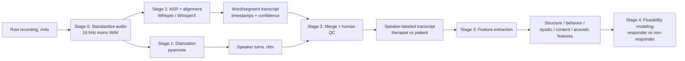

# PSYCH-ASR: Psychotherapy Session ASR, Diarization & Outcome-Linked NLP

Feasibility pipeline for **automated transcription and NLP-based characterization of
early psychotherapy sessions**, with the goal of predicting treatment response and
estimating therapist fidelity from what is actually said in the room.

Unlike most prior NLP-for-clinical-outcome work — which operates on text-based
interventions — this project works from **spoken psychotherapy session recordings**.
The near-term deliverable is feasibility data and reusable data-processing pathways to
support a grant application (R21, possibly R01) for processing the full set of sessions.

> **On-prem only.** Recordings are identifiable PHI. Every model in this pipeline
> (ASR, diarization, downstream NLP) runs locally on LIBR compute. No audio, transcript,
> or derived feature ever leaves the node or is sent to an external API. See
> [Privacy & Data Handling](#privacy--data-handling).

---

## Goals

1. Evaluate feasibility and accuracy of **ASR + speaker diarization** on LIBR
   psychotherapy recordings.
2. Extract early-session (sessions 1–3) language, interaction, and acoustic features.
3. Test whether those features predict treatment response **beyond** baseline severity
   and early symptom change.
4. Train preliminary models to estimate session- and item-level **therapist fidelity**
   from transcripts.

The feasibility framing matters: the goal is not a perfect transcript, but the ability to
**quantify transcript quality** and identify which feature types remain reliable enough to
use despite ASR/diarization error.

## Pilot design

- Parent trial: ~70/group randomized; ~65–68/group attended ≥1 session.
- Pilot subset: **N≈20** from one intervention (behavioral activation) — 10 good
  responders, 10 poor responders.
- Scope: transcribe/analyze **sessions 1–3** only. Powered for feasibility and pattern
  detection, not for confirmatory prediction.

---

## Pipeline



**Stage 0 — Standardize.** Convert each recording to 16 kHz mono WAV with a consistent
naming convention. (The pilot session recordings are ~50 min, 32 kHz, mono AAC — a
single mixed channel, so diarization cannot rely on channel separation.)

**Stage 1 — ASR + Diarization.** `whisper`/`whisperx` for the transcript with word-level
timestamps and confidence; `pyannote` for speaker turns. WhisperX is the intended glue: it
runs Whisper, forced-aligns to word-level timestamps, and assigns speakers from pyannote in
one pass.

**Stage 2 — Human-in-the-loop QC.** Map anonymous `SPEAKER_00/01` labels to
therapist/patient, flag and correct mid-session speaker swaps, and hand-correct a
*stratified subset* to estimate word error rate (WER) and diarization error rate (DER).

**Stage 3 — Feature extraction.** Conversation structure (talk-time ratio, turns, turn
length, speech rate, silence, overlap), therapist behaviors (question types, reflections,
validation, agenda-setting), patient behaviors (affect, approach/avoidance, hopelessness,
self-efficacy), dyadic process (e.g. reflection → patient emotion), content themes, and
acoustic/paralinguistic features (pause duration, pitch variability).

**Stage 4 — Feasibility modeling.** Do features separate responders from non-responders
beyond baseline severity and early symptom change?

---

## Environment & compute

On-prem Linux compute node with GPUs, Slurm-scheduled. Conventions mirror the TRD-EHR
project on this box:

- **Partition:** `c3_accel`, request GPUs via `#SBATCH --gres=gpu:N`.
- **Modules:** `module load Anaconda3/2025.06-0`.
- **Envs:** conda prefix envs under `/media/studies/ehr_study/analysis/mferguson/venvs/`
  (created by `setup_envs.sh`, not committed here).
- **GPU pinning:** jobs select the freest GPU via `nvidia-smi --query-gpu=memory.free`
  and set `CUDA_VISIBLE_DEVICES` to dodge bare-metal squatters Slurm can't see.

Core libraries: `whisper` / `whisperx`, `pyannote.audio`, `torch`, `ffmpeg` for
Stage 0. pyannote models are gated on Hugging Face — accept the terms and download
weights once with a token, after which everything runs offline.

---

## Repository layout

```
.
├── README.md              # this file (committed)
├── .gitignore             # PHI, audio, transcripts, envs all excluded
├── libraries.txt          # shortlist of core libraries
├── scripts/               # pipeline code (Stage 0–4)
├── slurm_jobs/            # .sbatch job scripts; logs/ gitignored
├── data/                  # raw + derived data — GITIGNORED (PHI)
└── writeup/               # private notes incl. TODO.txt — GITIGNORED
```

---

## Privacy & Data Handling

- Recordings are **identifiable PHI**; participant IDs appear in filenames.
- `.gitignore` excludes all audio, converted audio, transcripts, diarization output
  (`.rttm/.srt/.vtt`), and structured feature files (`.json/.csv/.parquet`) by default.
- All processing is **on-prem**; no external/cloud inference.
- Raw and derived data live under `data/` (gitignored) or on study storage — never in the
  tracked tree.
