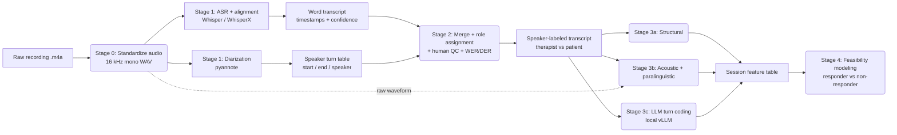

# PSYCH-ASR: Psychotherapy Session ASR, Diarization & Outcome-Linked NLP

> **AI assistants: read [`AI_INSTRUCTIONS.md`](./AI_INSTRUCTIONS.md) in full before doing
> anything.** It is the operating contract for this repository and it is model-agnostic —
> Claude, Codex, DeepSeek/open-code, Cursor, a local model, all the same. Nothing auto-loads
> it, so read it the moment you are pointed at this README.

Feasibility pipeline for **automated transcription and NLP-based characterization of
early psychotherapy sessions**, with the goal of predicting treatment response and
estimating therapist fidelity from what is actually said in the room.

Unlike most prior NLP-for-clinical-outcome work — which operates on text-based
interventions — this project works from **spoken psychotherapy session recordings**.
The near-term deliverable is feasibility data and reusable data-processing pathways to
support a grant application (R21, possibly R01) for processing the full set of sessions.

> **On-prem only.** Recordings are identifiable PHI. Every model in this pipeline
> (ASR, diarization, downstream NLP) runs locally on LIBR compute. No audio, transcript,
> or derived feature ever leaves the node or is sent to an external API. See
> [Privacy & Data Handling](#privacy--data-handling).
> **Companion documentation — read this first.** This README documents the *pipeline
> architecture*. The plain-language research narrative and this project's live task list
> live in the separate **`Research-Journey`** repo, in the home folder as a sibling of this
> repo (`~/Research-Journey`). It is its own private git repo (on GitHub as
> `Pirate-Hunter-Zoro/Research-Journey`) and is a **multi-project narrative hub** covering
> both this project and the sibling `TRD-EHR` project. Start there for "where are we / what's
> the story"; this project's live task list is `~/Research-Journey/planning/PSYCH-ASR_TODO.txt`.
>
> **Conceptual walkthrough of Stage 1.** A slide deck explaining what
> `scripts/run_whisperx.py` actually does — a broad tour of what each of the five calls
> accomplishes, with the input and output stated at every step, a pipeline diagram of how the
> waveform and the words flow between the three models, and the traps worth knowing (loose
> Whisper timestamps, why alignment must precede diarization, unlabelled words) — lives at
> `~/Research-Journey/psych-asr-feasibility/stage1_pipeline_walkthrough.pdf`, built from the
> `.tex` beside it. Read it before modifying Stage 1.
>
> **Division of labour between the two files.** The TODO tracks **only what is left**.
> Finished work is never annotated there as "DONE" — its entry is deleted, and whatever
> is durably worth knowing (what exists, where it lives, how it was staged, which traps
> were paid for) graduates **into this README**. Git history records completion; the TODO
> records intent. Anyone editing either file, human or agent, follows this.

---

## Goals

1. Evaluate feasibility and accuracy of **ASR + speaker diarization** on LIBR
   psychotherapy recordings.
2. Extract early-session (sessions 1–3) language, interaction, and acoustic features.
3. Test whether those features predict treatment response **beyond** baseline severity
   and early symptom change.
4. Train preliminary models to estimate session- and item-level **therapist fidelity**
   from transcripts.

The feasibility framing matters: the goal is not a perfect transcript, but the ability to
**quantify transcript quality** and identify which feature types remain reliable enough to
use despite ASR/diarization error.

## Pilot design

- Parent trial: ~70/group randomized; ~65–68/group attended ≥1 session.
- Pilot subset: **N≈20** from one intervention (behavioral activation) — 10 good
  responders, 10 poor responders.
- Scope: transcribe/analyze **sessions 1–3** only. Powered for feasibility and pattern
  detection, not for confirmatory prediction.

---

## Pipeline


```mermaid
graph LR
    A[Raw recording .m4a] --> B(Stage 0: Standardize audio<br/>16 kHz mono WAV)
    B --> C[Stage 1: ASR + alignment<br/>Whisper / WhisperX]
    B --> D[Stage 1: Diarization<br/>pyannote]
    C --> E[Word transcript<br/>timestamps + confidence]
    D --> F[Speaker turn table<br/>start / end / speaker]
    E --> G(Stage 2: Merge + role assignment<br/>+ human QC + WER/DER)
    F --> G
    G --> H[Speaker-labeled transcript<br/>therapist vs patient]
    H --> I1(Stage 3a: Structural)
    H --> I2(Stage 3b: Acoustic + paralinguistic)
    B -. raw waveform .-> I2
    H --> I3(Stage 3c: LLM turn coding<br/>local vLLM)
    I1 --> J[Session feature table]
    I2 --> J
    I3 --> J
    J --> K(Stage 4: Feasibility modeling<br/>responder vs non-responder)
```

**Stage 0 — Standardize.** Convert each recording to 16 kHz mono WAV with a consistent
naming convention. (The pilot session recordings are ~50 min, 32 kHz, mono AAC — a
single mixed channel, so diarization cannot rely on channel separation.)

**Stage 1 — ASR + Diarization.** `whisper`/`whisperx` for the transcript with word-level
timestamps and confidence; `pyannote` for speaker turns. WhisperX is the intended glue: it
runs Whisper, forced-aligns to word-level timestamps, and assigns speakers from pyannote in
one pass.

**Stage 2 — Human-in-the-loop QC.** Map anonymous `SPEAKER_00/01` labels to
therapist/patient (machine-proposed from lexical cues, human-confirmed), flag and correct
mid-session speaker swaps, and hand-correct a *stratified subset* to estimate word error
rate (WER) and diarization error rate (DER).

**Stage 3 — Feature extraction**, deliberately split into three lanes that fail
independently, ordered by how much they depend on the transcript being right:

- **3a Structural** — talk-time ratio, turn counts and lengths, speech rate, silence,
  turn-taking latency, overlap and interruptions. Computed from timestamps alone, so it
  survives a mediocre transcript and is the first thing to build.
- **3b Acoustic / paralinguistic** — per-word prosody (pitch, loudness, duration) read off
  the raw waveform at the word boundaries alignment already produced; dimensional affect
  per turn; and detection of non-verbal vocal events (sighs, breaths, laughter, throat
  clearing) in the gaps between words. Uses the transcript only for *where to look*, never
  for *what was said*.
- **3c Behavioral / content coding** — therapist behaviors (question types, reflections,
  validation, agenda-setting), patient behaviors (affect, approach/avoidance,
  hopelessness, self-efficacy), dyadic process, and content themes, coded turn by turn by
  a locally served LLM. This lane is the one that actually depends on words being correct,
  and therefore the one whose reliability Stage 2's WER estimate governs.

**Stage 4 — Feasibility modeling.** Do features separate responders from non-responders
beyond baseline severity and early symptom change?

---

## Environment & compute

On-prem Linux compute node with GPUs, Slurm-scheduled. Conventions mirror the TRD-EHR
project on this box:

- **Partition:** `c3_accel`, request GPUs via `#SBATCH --gres=gpu:N`.
- **Modules:** `module load Anaconda3/2025.06-0`.
- **Env:** one conda *prefix* env, `asr_env` (Python 3.11), under
  `/media/studies/ehr_study/analysis/mferguson/venvs/`, built by
  `scripts/setup_envs.sh` (not committed here).
- **GPUs:** request them with `#SBATCH --gres=gpu:N`. The cluster runs
  `task/cgroup` with `ConstrainDevices=yes`, so a job sees only its allocated
  devices and Slurm sets `CUDA_VISIBLE_DEVICES` itself. Jobs log an `nvidia-smi`
  memory line so a later CUDA OOM is explainable from the log alone.
- **Model weights (offline):** the login node has outbound internet; the compute
  nodes do not. All model weights are downloaded once into a `models/` directory on
  study storage and loaded from there by absolute path, with `HF_HUB_OFFLINE=1` set
  in every job so a stray Hub request fails fast instead of hanging on a compute
  node.

Core libraries (pinned in `scripts/setup_envs.sh`): **`whisperx` 3.8.6 anchors the
whole stack** — its `~=` dependency pins force `torch`/`torchaudio` 2.8.x,
`torchvision` 0.23.x, `ctranslate2` 4.8.1, `faster-whisper` 1.2.1, and
`pyannote.audio` 4.0.7, alongside `transformers` 4.55.4, `soundfile`, and the
system `ffmpeg` 5.1.9 used for Stage 0. The node's CUDA-13.3 driver runs the cu12
`torch` wheels (backward-compatible); ctranslate2's cuDNN 9 rides in with torch, so
no system cuDNN is required. pyannote models are gated on Hugging Face — accept the
terms and download weights once with a token, after which everything runs offline.

**Adding libraries without breaking that pin chain.** Because `whisperx` fixes `torch`
transitively, any new dependency that pins torch itself is not a package addition but an
environment fork. The Stage 3b acoustic tools are safe to add in place — `opensmile` and
`praat-parselmouth` ship self-contained binary wheels and depend on nothing heavier than
`numpy`/`pandas` — and the Stage 3b model checkpoints load through the `transformers`
already present. **vLLM is not safe to add in place**: it carries its own torch
requirement and would drag the whole ASR stack with it. Stage 3c therefore runs from a
*separate* prefix env, the way the sibling TRD-EHR project already separates its
`embedder_pipeline` env from its analysis envs. Two envs, one talking to the other over
HTTP, is the intended shape — not one env that satisfies both.

### Environment architecture

The same reasoning that forks Stage 3c forks the diarization bake-off, and for the same
cause: a competing diarizer that pins its own `torch` is an environment fork, not a
package addition. All four now exist, built by `scripts/setup_envs.sh`, each ending in its
own import smoke-check.

| Env | Python / torch | Holds | Why separate |
| --- | --- | --- | --- |
| `asr_env` | 3.11 / 2.8.0+cu128 | whisperx 3.8.6, pyannote.audio 4.0.7 — ASR, alignment, the community-1 baseline diarizer, and the speaker join | Pin set is **locked** to whisperx's `~=` chain |
| `diarizen_env` | 3.10 / 2.1.1+cu121 | DiariZen (MIT code) and its vendored pyannote-audio fork (reports itself as pyannote.audio 3.1.1) | torch 2.1.1 vs 2.8.0 is a hard conflict — unresolvable in one env |
| `nemo_env` | 3.11 / 2.13.0+cu130 | `nemo_toolkit[asr]` 2.7.3, for both Sortformer checkpoints | Drags hydra, lightning, omegaconf and its own `transformers` pin against the locked 4.55.4 |
| `diar_eval_env` | 3.11 / **none** | `pyannote.metrics` 3.2.1 only, CPU | Deliberately torch-free. The scorer must be *one* implementation at *one* collar across every arm, or the comparison measures the scorer instead of the models |

`diar_eval_env` is the one that looks like over-engineering and is not. Folding the scorer
into `asr_env` risks bumping `pyannote.core` underneath the locked pin set, and it quietly
couples "how we measure" to "what we measure with."

**DiariZen is a source install, not a package.** It is not on PyPI, and it vendors its own
`pyannote-audio` fork *in-tree* rather than depending on the released one — the upstream
pipeline will not accept the raw powerset segmentation checkpoint that DiariZen's subclass
needs. `setup_envs.sh` therefore clones
`github.com/BUTSpeechFIT/DiariZen` into `/media/studies/ehr_study/analysis/mferguson/src/`
and installs three things in order: the cu121 torch trio, the requirements, then the
package and the vendored fork as editable installs. Every step after the first passes
`-c constraints.txt`, which re-pins `torch` and `numpy` so that neither the requirements nor
the fork can drag torch forward underneath the install. The only true git submodule in that
repo is `dscore`, and it is not needed — scoring happens in `diar_eval_env`.

**`pyannote.metrics` needs `typing_extensions` and does not declare it.** A clean env built
from `pyannote.metrics` alone fails on its own first import. It is pinned explicitly in
`setup_envs.sh`; do not remove it on the grounds that nothing appears to use it.

### The seam that makes this cheap

`whisperx.assign_word_speakers` reads exactly three columns off the diarization
DataFrame — `start`, `end`, `speaker` — and ignores `segment` and `label` entirely
(verified in the installed `whisperx/diarize.py`). **Any** diarizer that can emit those
three fields substitutes in with no change to whisperx and no change to the join.

So the interchange format is **RTTM**, and Stage 1 splits at that seam:

| Step | Script | Env | In | Out |
| --- | --- | --- | --- | --- |
| 1a ASR + alignment | `run_asr.py` | `asr_env`, GPU | one 16 kHz WAV | `<stem>.aligned.json` — no speaker keys |
| 1b diarize | `diarize_pyannote.py` / `diarize_diarizen.py` / `diarize_sortformer.py` | per-model env, GPU | the same WAV | `<stem>.<arm>.rttm` |
| 1c join + render | `join_speakers.py` | `asr_env`, CPU | aligned JSON + one RTTM | `<stem>.<arm>.diarized.json` + `<stem>.<arm>.transcript.txt` |

`scripts/rttm_io.py` is the shared reader/writer. It is imported from **all four** envs,
whose torch and numpy pins are mutually incompatible, so it imports nothing at module scope
beyond the standard library — `pandas` is imported inside the one function that returns the
DataFrame shape `assign_word_speakers` wants.

**The arm name is carried in every filename from 1b onward.** Which transcript came from
which diarizer is a property of the file, not of a note somewhere — and 1c derives the arm
from the RTTM's own name, so adding a fifth arm needs no change to the join.

RTTM is chosen because it is simultaneously the standard diarization interchange format
*and* what DER scorers consume. The hypothesis file the bake-off scores and the file the
join reads are the same artifact — no second serialization to keep in sync.

**The methodological reason for the split, which matters more than the compute saving.**
Stage 1 currently costs ~3 minutes on one A40, so re-running ASR per diarizer is affordable.
It is still wrong: Whisper's output would then differ across arms, and a DER comparison would
be confounded by transcript differences. Running 1a **once** and fanning every diarizer off
the identical aligned transcript and identical word timings is what makes the arms
comparable at all.

**The refactor has a built-in regression test.** Job 2032471 (2026-08-12, full ~50 min
session) produced 489 segments, 7298 words, exactly 2 speaker labels, 89 turns, one UNKNOWN
segment, 79/21 talk time. Composing 1a → 1b(community-1) → 1c must reproduce those numbers
exactly. If it does not, the split changed behavior and the difference is a bug, not a
finding.

### Staging model weights (offline)

Because compute nodes have no internet, every model is downloaded **once on the login
node** into a `models/` directory on study storage and thereafter loaded by absolute
path with `HF_HUB_OFFLINE=1`. The Hugging Face CLI (`hf`) ships inside the `asr_env`
conda environment.

**Diarization model — `pyannote/speaker-diarization-community-1`.** WhisperX 3.8.6
defaults its diarizer to this model, and pyannote.audio 4.0.7's `SpeakerDiarization`
pipeline is built around it: segmentation, embedding, and PLDA all live as subfolders
of that single repo, and clustering defaults to `VBxClustering`. Because it is
self-contained, staging it needs no config edits and no `--diarize_model` override.
`Pipeline.from_pretrained` accepts the local *directory* and finds `config.yaml` inside
it — there is no need to name the yaml file — and the config's `$model/...` references
resolve against that same directory.

Its speaker embedder is **WeSpeaker ResNet34 trained on VoxCeleb**, which maps a chunk
of speech to a fixed-width vector such that same-speaker chunks land near each other;
clustering those vectors is what separates the speakers. The config sets
`embedding_exclude_overlap: true`, so regions where both people talk at once are left
out of embedding extraction and do not contaminate the speaker profiles — relevant here
because therapist backchannels ("mm-hm") overlap patient speech constantly.

> The older `pyannote/speaker-diarization-3.1` does **not** work offline on
> pyannote.audio 4.0.7: the 4.x pipeline constructor loads a PLDA model
> unconditionally, and the 3.1 config predates PLDA, so an offline load raises
> `LocalEntryNotFoundError`. Use community-1.

One-time setup:

1. **Authenticate.** Create a read-scoped token at
   `huggingface.co/settings/tokens` and place it in a git-ignored `.env` at the repo
   root as `HF_TOKEN=...`. Never commit the token.
2. **Accept the gate.** While logged in as the token's account, open the model page
   and click *"Agree and access repository."* community-1 is auto-gated, so access is
   granted instantly (no manual approval).
3. **Download into `models/`.** With `asr_env` active, from the repo root:

   ```bash
   set -a; source .env; set +a        # export HF_TOKEN for this shell
   hf download pyannote/speaker-diarization-community-1 \
     --local-dir /media/studies/ehr_study/analysis/mferguson/models/pyannote-speaker-diarization-community-1
   ```

   Do **not** set `HF_HUB_OFFLINE` for the download — only for the later load.
4. **Load offline.** In pipeline code, set `HF_HUB_OFFLINE=1` and call
   `Pipeline.from_pretrained()` with the **absolute local directory**, never the Hub id.

### Diarization bake-off — candidate models

community-1 is the incumbent, not a verdict. Diarization is the bottleneck the whole project
is gated on, so the choice deserves a measurement rather than a default. All four arms are
staged, scripted and runnable; none is *scored* yet, because scoring needs the reference
RTTM that Stage 2's hand-correction pass produces.

| Arm | Model | `--arm` name | Env | Weights license |
| --- | --- | --- | --- | --- |
| baseline | `pyannote/speaker-diarization-community-1` | `community-1` | `asr_env` | open, self-host free |
| A | `BUT-FIT/diarizen-wavlm-large-s80-md-v2` | `diarizen` | `diarizen_env` | **CC BY-NC 4.0** (code is MIT) |
| B | `nvidia/diar_sortformer_4spk-v1` (offline) | `sortformer` | `nemo_env` | **CC BY-NC 4.0** |
| C | `nvidia/diar_streaming_sortformer_4spk-v2.1` | `sortformer-streaming` | `nemo_env` | NVIDIA Open Model License |
| escalation | `pyannote precision-2` | — | — | proprietary; on-prem requires an Enterprise contract |

None of the three challengers is gated on Hugging Face, so unlike the pyannote weights they
need no click-through before download.

**Licensing is a real constraint here, not boilerplate.** Arms A and B are
non-commercial-only. For feasibility research at a nonprofit institute that is fine, but the
stated deliverable is an R21/R01, and an NC weight license is the kind of thing that is
invisible for two years and then blocks a translation path. Arm C is the only strong
candidate without that restriction. Record which arm wins *and* whether it can be shipped.

**Why these three challengers.** Both Sortformer variants and DiariZen model overlapping
speech directly — Sortformer frame-level and multi-label, DiariZen powerset over up to four
concurrent speakers — where community-1's configuration sets `embedding_exclude_overlap`,
protecting its speaker profiles by discarding the overlapped regions rather than resolving
them. Therapist backchannels over patient speech are constant in this corpus and are
themselves a Stage 3a feature, so how a diarizer treats overlap is not a side issue.

**Published DER numbers across these projects are not comparable and must not be tabled
together.** DiariZen reports at collar 0 s; the NVIDIA CALLHOME figures use the conventional
0.25 s collar. A collar forgives boundary error at every speaker change, and the same system
looks far worse without one. The only numbers that will decide this are the ones measured
here, on this audio, under one collar setting chosen and stated once.

**Two open questions to settle before trusting any arm:**

- *Can the end-to-end models be pinned to two speakers?* The pyannote path takes an exact
  `num_speakers` and the pipeline currently pins it to 2. Sortformer is end-to-end with a
  four-speaker ceiling and no clustering stage to constrain the same way. On a known dyad
  that constraint is worth real DER, and losing it is a genuine cost of switching.
- *Do they survive a 50-minute file?* An end-to-end transformer over a full session is a
  memory question the meeting-corpus benchmarks do not answer. The streaming variant handles
  arbitrary length by construction, which may turn out to be arm C's decisive advantage
  independent of accuracy.

### Scoring protocol

One scorer, one collar, every arm — run from `diar_eval_env`.

- **Reference:** the hand-corrected RTTM from Stage 2's stratified subset. That subset is
  already planned for WER/DER estimation; it is the bake-off's test set, not extra work.
- **Report DER at both collar 0.25 s and collar 0 s, overlap included**, and say which is
  which. Overlap-excluded scoring would discard exactly the regime under test.
- **Decompose DER** into missed speech, false alarm, and speaker confusion. Published
  benchmarking finds missed speech dominates, and the decomposition says which knob to turn.
- **Two therapy-specific measures alongside DER**, because DER is a duration-weighted average
  and can look acceptable while failing where it matters: error in the therapist/patient
  talk-time ratio, and backchannel attribution accuracy.

**ASR model — `Systran/faster-whisper-large-v3`.** Staged into
`models/faster-whisper-large-v3` and loaded by absolute path. `scripts/stage_models.sh`
automates the login-node staging: it activates `asr_env`, sources the git-ignored `.env`
with auto-export on (so the `hf` CLI actually inherits `HF_TOKEN` — without auto-export
the token stays shell-local and the download 401s), clears `HF_HUB_OFFLINE` for the
download only, then runs `hf download --local-dir`. A successful stage leaves seven files
with `model.bin` at ~3.6 GB; the `.lock` residue under `.cache/huggingface/download/` is
normal and can be ignored — the half-failed case is locks with *no* real weights beside
them.

The same download recipe stages any other Hugging Face model: one
`hf download ... --local-dir models/<name>` on the login node, then load by path.
`stage_models.sh` now also pulls the three bake-off challengers this way
(`diarizen-wavlm-large-s80-md-v2`, `diar_sortformer_4spk-v1`,
`diar_streaming_sortformer_4spk-v2.1`) plus the WeSpeaker embedder DiariZen needs — about
1.8 GB in total, which is small enough that the staging step is not the slow part of
anything.

**How each challenger reaches its weights offline**, since all three differ from the
`Pipeline.from_pretrained(<dir>)` pattern community-1 uses:

- **Sortformer (both arms)** loads from the `.nemo` archive with
  `SortformerEncLabelModel.restore_from`, which reads the file directly and makes no Hub
  call at all. NVIDIA's cards use `from_pretrained` with a token; `restore_from` is the
  offline equivalent and takes `strict=False`. Arm B's repo also ships transformers-native
  safetensors beside the archive; they are downloaded and unused, because arm C ships no
  such thing and one loading path across both arms is worth more than saving 500 MB.
- **DiariZen** is the awkward one. `DiariZenPipeline.from_pretrained()` calls
  `snapshot_download` and `hf_hub_download` internally, so it wants either the network or a
  directory in Hugging Face *cache* layout — which is not the `--local-dir` layout
  everything else here uses. `scripts/diarize_diarizen.py` sidesteps it by constructing the
  pipeline directly from two absolute paths, which is all `from_pretrained` does once its
  two downloads resolve: the model hub directory, and the WeSpeaker embedder's
  `pytorch_model.bin` as a plain file path.
- **DiariZen's WavLM is not a third download.** Its `config.toml` names
  `wavlm_src = "wavlm_large_s80_md"`, which looks like a repo id and is not — it resolves to
  a hardcoded configuration dict in `diarizen/models/module/wavlm_config.py`, and the pruned
  WavLM weights themselves are inside the 278 MB `pytorch_model.bin`. Nothing to stage.

> **Verify a staged model, don't assume it.** `hf download` can terminate leaving a
> directory that contains only `README.md` and empty weight subfolders, with lock files
> under `.cache/huggingface/download/` as the only trace. The directory looks staged from
> a casual `ls`. Always confirm by file count *and* an actual offline load before treating
> a model as available.

**Forced alignment is not a Hugging Face download.** For English, WhisperX resolves its
alignment model to a **torchaudio** bundle (`WAV2VEC2_ASR_BASE_960H`), fetched from
`download.pytorch.org` into the Torch hub cache — not from the Hugging Face Hub. Setting
`HF_HUB_OFFLINE=1` therefore does *not* protect this path, and on a node without outbound
internet it will stall exactly the way an unstaged Hub model does. That cache is warmed on
the login node by `scripts/stage_models.sh`, which exports `TORCH_HOME` to
`models/torch_home` on study storage and runs `scripts/warm_align_cache.py`; torch writes
the 360 MB `wav2vec2_fairseq_base_ls960_asr_ls960.pth` into a `hub/checkpoints` subfolder
of it, and a re-run reuses it silently. **Every job must export the same `TORCH_HOME`** —
exporting the variable, not merely having the files on disk, is what makes torch reuse the
cache instead of re-fetching into `~/.cache`.

**Sentence splitting is a third offline dependency.** WhisperX's alignment step imports
`nltk` and loads `tokenizers/punkt_tab/english.pickle`, falling back to a live
`nltk.download()` if the lookup fails — an outbound call that neither `HF_HUB_OFFLINE` nor
`TORCH_HOME` covers. `scripts/stage_models.sh` downloads the `punkt_tab` package into
`models/nltk_data` and exports `NLTK_DATA` to it. Note that **`english.pickle` does not
exist as a file**: `punkt_tab` ships per-language folders of `.tab`/`.txt` data and NLTK
synthesizes a `PunktTokenizer` from them when that name is requested. The absence of a
`.pickle` on disk is not a failed download.

**Three environment variables must be exported in every job**, not merely pointed at:
`HF_HUB_OFFLINE=1`, `TORCH_HOME`, and `NLTK_DATA`. Each library reads its own variable to
find its cache; having the files on study storage is necessary but not sufficient.

---

## Running Stage 1

**Input convention: `data/inbox/` holds exactly one `.wav`.** The Stage 1 job takes no
arguments — it globs the inbox, counts the matches, and aborts with its own message if
the count is anything other than one, so a mistake surfaces as a one-line error instead
of a Python traceback (two files silently became a two-line path before the guard
existed). `standardize.sh` writes its 16 kHz WAV beside the source recording; moving the
one you want processed into the inbox is a deliberate manual step.

Submit **from the repo root**. The job's log paths and its `scripts/run_whisperx.py`
invocation are all relative and resolve against the submit directory.

- `slurm_jobs/stage1_whisperx.sbatch` — 1 GPU, 2 h wall, 8 CPUs, 64 G. Loads
  `Anaconda3/2025.06-0`, activates `asr_env` inside a `set +u` / `set -u` wrap, and
  exports the four variables every job needs: `PYTHONNOUSERSITE`, `HF_HUB_OFFLINE`,
  `TORCH_HOME`, `NLTK_DATA`.
- `scripts/run_whisperx.py` — takes the audio path positionally, plus `--outdir`
  (default `data/stage1`), `--model-dir` (default the staged
  `faster-whisper-large-v3`), `--batch-size` (default 16), `--diarize-model-dir`
  (default the staged `pyannote-speaker-diarization-community-1`), and
  `--num-speakers` (default 2).
- `scripts/render_transcript.py` — the readable-transcript renderer. Imported and
  called by `run_whisperx.py` as its last step, so the job emits both artifacts; also
  runnable standalone on any existing `.diarized.json` (see **Readable transcript**
  below).

> **The split now exists alongside this.** `run_whisperx.py` and its sbatch remain the
> single-job path for one session against the incumbent diarizer, and they are unchanged.
> The 1a/1b/1c chain described in **Running the diarization bake-off** below is what to use
> for anything comparing diarizers, and it is the path that will absorb new arms. The four
> passes below are the same four passes; the split only moves where each one runs.

The script decodes the audio **once** with `whisperx.load_audio` and reuses that array
for all three passes, so ffmpeg runs a single time:

1. **ASR.** Loads the Whisper model by **absolute local path** with `local_files_only`,
   `float16`, and language forced to English (skipping per-chunk detection), then
   transcribes. Produces segments with loose (±~0.5 s) boundaries.
2. **Forced alignment.** `whisperx.load_align_model` for the detected language — which
   for English resolves to the **torchaudio** `WAV2VEC2_ASR_BASE_960H` bundle out of
   `TORCH_HOME`, not a Hub download — then `whisperx.align` re-times the existing text
   against the waveform at phoneme resolution. Adds a `words` list per segment with
   per-word `start`/`end`/`score`. Note this step *re-splits* segments at sentence
   boundaries (via nltk `punkt_tab`), so the aligned segment count is normally **higher**
   than the ASR segment count. `avg_logprob` is carried through the split.
3. **Diarization.** `DiarizationPipeline` pointed at the local community-1 directory,
   called with `num_speakers`, then `whisperx.assign_word_speakers` joins its turns onto
   the transcript by timestamp overlap.

**Why forced alignment must precede diarization.** Diarization emits speaker turns as
timestamps, and the join is purely temporal. Whisper's native segment edges are loose
enough that a boundary landing inside a speaker change would stamp words onto the wrong
person. Word-level times make the join tight.

**Why `--num-speakers` defaults to 2, rather than letting the pipeline infer it.** The
clustering step decides the speaker count from the data, and it errs in *both*
directions: it can split one person into two clusters when their voice shifts (a calm
patient vs. a distressed one), and it can merge two similar voices into one. Every pilot
session has exactly two people in it, so constraining the count removes both failure
modes for free. The flag exists rather than a hardcoded 2 in case a session turns out to
have a third person present.

**Output:** two files per session — `data/stage1/<stem>.diarized.json` (the machine
artifact, described next) and `data/stage1/<stem>.transcript.txt` (the human reading
copy, see **Readable transcript** below).

`<stem>.diarized.json` is a dict of `segments`, `word_segments`,
and `language`. Each segment carries `start`, `end`, `text`, `avg_logprob`, a `words`
list, and a `speaker` label; each word carries `start`, `end`, `score`, and `speaker`.
That `avg_logprob` is the per-segment confidence Stage 2's quality triage runs on. As a
working scale, above −0.5 is a confident decode and below −1.0 is where Whisper starts
hallucinating. Speaker labels are anonymous (`SPEAKER_00` / `SPEAKER_01`) — nothing in
the audio identifies roles, so mapping them to therapist/patient is Stage 2's first job.

> **`speaker` is not guaranteed on every segment or word.** `assign_word_speakers` sets
> it only where the transcript span actually overlaps a diarized turn, and `fill_nearest`
> is off by default, so there is no fallback. Anything reading these files must tolerate a
> missing key rather than indexing it directly. A few unlabeled items is normal; many
> means diarization under-covered the audio.

### Words with no speaker — three causes wearing one mask

An unlabeled word looks like a diarization failure and usually is not. Reading
`whisperx/diarize.py` and `whisperx/alignment.py` in the installed 3.8.6, there are exactly
three ways `speaker` fails to appear on a word, and they call for three different fixes:

1. **The word has no `start`.** `assign_word_speakers` opens its per-word loop with a skip:
   no `start` key, `continue`, never queried against the turn table at all. Alignment
   produces such a word when none of its characters received a timestamp — digits, symbols,
   and foreign script go through the wildcard emission column and can come back NaN — *and*
   the sentence-level interpolation fallback could not fill it, which happens only when no
   other word in that sentence has a timestamp either. This is an **alignment** artifact.
2. **The word has zero duration.** The overlap test requires the intersection of word and
   turn to be strictly greater than zero, so a word whose `start` and `end` round to the
   same millisecond matches nothing even when it sits squarely inside a speaker turn. Also
   an alignment artifact, and invisible unless you look for it.
3. **The word is timestamped, real, and overlaps no turn.** Only this one is a genuine
   diarization-coverage story: pyannote emitted no turn covering that span. With
   `fill_nearest` off, nothing is assigned.

A fourth case hides from a naive count entirely: a segment that fails alignment outright
(`no characters in this segment found in model dictionary`, or a start time past the audio
duration) is appended with an empty `words` list, so its words never exist to be counted as
missing. Segment count and word count are both silently short.

`scripts/audit_speakers.py` is the diagnostic that separates these — it buckets every
unlabeled word by cause and cross-tabs it against whether the parent *segment* got a
speaker, which distinguishes micro-gaps between turns (unlabeled words scattered inside
labelled segments) from a genuinely uncovered stretch of audio. Cause 3 cannot be confirmed
from `.diarized.json` alone; it needs the turn table, which is why persisting that table
(see *What Stage 1 currently throws away*) gates finishing the audit.

### Readable transcript

The `.diarized.json` is the machine artifact; nobody can read indented JSON with a
`words` list on every segment against playing audio. `scripts/render_transcript.py`
renders the same content as a play script and writes
`data/stage1/<stem>.transcript.txt`. `run_whisperx.py` calls it as its final step (CPU
only, sub-second, no models), so a single Stage 1 job produces both files. It also runs
standalone — give it a `.diarized.json` path and optionally `--outdir` (default: beside
the input) — which is how to re-render after any change to the format without paying for
another GPU job.

Format: a summary header, then one block per **turn**, where a turn is a run of
consecutive segments sharing a speaker, collapsed into a single paragraph:

```text
[03:12] SPEAKER_00
    So how has the week been since we last talked? ...
```

Grouping matters because forced alignment re-splits segments at sentence boundaries, so
one uninterrupted minute of speech arrives as a dozen segments — ungrouped, the file
reads as a list of sentences rather than a conversation. Timestamps are `mm:ss` with
minutes deliberately left unbounded (`62:04`, not `1:02:04`) so a single scale matches
what a media player's position readout shows. Per-word timings stay in the JSON; a
reading copy is segment-level text only.

The header carries audio span, total speech time, segment and turn counts, and a
per-speaker table of talk time, share of speech, turns, and segments — printed to the
job log as well as written into the file. **Talk-time share is the cheapest possible
diarization sanity check**: two people in a room do not split 97/3, so that number
falsifies a collapsed clustering from the log alone, before anyone opens the audio. It
is also the first Stage 3 structural feature, so it is worth having early. The
denominator is total speech time, not wall-clock span, so silence does not dilute the
split between the two people.

Segments with no `speaker` key are rendered as `UNKNOWN` rather than dropped or merged
into the neighbouring turn — a cluster of `UNKNOWN` blocks is itself the diagnostic that
diarization under-covered the audio, and hiding them would hide that. `UNKNOWN` always
sorts last in the summary table; it is a diagnostic, not a person.

The `.txt` is session content and therefore PHI. It is written under `data/stage1/`,
which `.gitignore` excludes wholesale — do not write it anywhere else.

> **`DiarizationPipeline` is not exported at package level.** WhisperX 3.8.6's
> `__init__.py` lazily exposes only `load_model`, `load_audio`, `load_align_model`,
> `align`, `assign_word_speakers`, and the logging helpers. `whisperx.DiarizationPipeline`
> raises `AttributeError`; import the class from `whisperx.diarize`.

**Status.** All four passes are verified end to end on the **full first pilot session**
(~50 min): 489 segments, 7,298 words, coverage to 50:39 of a 50:39 file, exactly 2
speaker labels, 89 turns, and **one** segment left `UNKNOWN` — diarization covered
essentially the whole transcript. The whole job took roughly three minutes of wall clock
on one A40, so the 2 h wall-time request is generous by two orders of magnitude and the
GPU never needed the ASR model freed between passes.

Talk time split **79% / 21%**. That is lopsided but not a collapsed clustering — this is
session 1, whose own opening states the therapist will do most of the talking to deliver
the treatment rationale. Expect a more even split from sessions 2–3; if session 1's
pattern repeats there, *then* suspect the clustering.

What is **not** established: accuracy. Segment counts and talk-time ratios prove the
plumbing and that diarization produced a plausible two-speaker structure. Whether the
labels track the actual therapist and patient — and whether they stay correct through the
middle of the session, where turn-taking gets messy — needs the human check against the
audio. That is the open item, and nothing downstream should be built before it passes.

Two warnings in the job's stderr are benign and expected: Lightning auto-upgrading the
checkpoint format of WhisperX's bundled VAD model, and pyannote disabling TF32 matmuls
for reproducibility (a small speed cost, nothing else).

---

## Running the diarization bake-off

Same input convention as Stage 1: `data/inbox/` holds exactly one `.wav`, and every job
globs it and guards on the count. Submit **from the repo root** — all paths are relative to
the submit directory.

```bash
bash slurm_jobs/run_bakeoff.sh
```

That submits the whole chain as one dependency graph and prints the job ids:

```text
1a ASR + align  ──┬─> 1b community-1          (asr_env,      GPU)  ──┐
                  ├─> 1b diarizen             (diarizen_env, GPU)  ──┤
                  ├─> 1b sortformer           (nemo_env,     GPU)  ──┼─> 1c join + render
                  └─> 1b sortformer-streaming (nemo_env,     GPU)  ──┘   (asr_env, CPU)
```

**The dependency kinds are not interchangeable.** The 1b jobs depend on 1a with `afterok` —
there is nothing to diarize against if the transcript never landed. 1c depends on the four
arms with **`afterany`**, so one arm crashing still produces transcripts for the others; a
dead arm then shows up as a missing file, which is a result rather than a silent gap. 1c
iterates over whatever RTTMs exist rather than a fixed arm list, for the same reason.

**1c asks for no GPU.** It loads no models — a timestamp join and a text render, seconds of
CPU per arm — so it runs on `c3_short` rather than occupying `c3_accel`, which is the single
four-GPU node the arms themselves need.

Individual jobs run standalone too (`sbatch slurm_jobs/stage1b_diarizen.sbatch`), which is
how to re-run one arm without paying for the rest.

### Artifacts, and which model produced which

| File | Written by | Holds |
| --- | --- | --- |
| `<stem>.aligned.json` | 1a | words + timings, **no speaker keys** |
| `<stem>.<arm>.rttm` | 1b | that arm's speaker turn table |
| `<stem>.community-1.exclusive.rttm` | 1b baseline | the same diarization with per-frame speaker count clamped to 1 |
| `<stem>.<arm>.diarized.json` | 1c | the machine artifact, one per arm |
| `<stem>.<arm>.transcript.txt` | 1c | the readable transcript, one per arm |
| `<stem>.arm_comparison.json` | `compare_arms.py` | the word-level diff between arms |

**The turn table is no longer thrown away** — it is the RTTM, and it is the same file the
DER scorer will consume. That closes the first of the three items under *What Stage 1
currently throws away* below, for the bake-off path. The baseline arm additionally persists
`exclusive_speaker_diarization`, which is what makes overlapping speech recoverable as a set
difference rather than reconstructed from turn intersections.

### The regression gate

The 1c job ends by running `scripts/check_split_regression.py`, comparing the baseline arm's
output through the split against the pre-split fixture from job 2032471. It reports two
levels separately: **structure** (segment/word/turn counts, speaker labels, unlabeled counts,
talk-time shares), where a mismatch means the refactor changed behavior and is a bug; and
**exact fields**, where a mismatch with matching structure is worth reading before worrying
about, since Whisper decodes in float16 on a GPU and is not bit-reproducible across runs.

### What differs per arm, and why it is a finding rather than a detail

- **Pinning the speaker count works differently in all three, and in one of them the
  obvious knob is a decoy.** On the baseline, `--num-speakers 2` is an exact count passed
  straight to pyannote. Sortformer is end-to-end with a hard four-speaker ceiling and no
  clustering stage to constrain at all, so `diarize_sortformer.py` accepts `--num-speakers`
  for flag compatibility and **ignores it, saying so in the log**. On a known dyad that
  constraint is worth real DER, so losing it is a genuine cost of switching.

  DiariZen is the decoy. Its `__call__` passes `min_clusters` / `max_clusters` into the
  clustering, which reads exactly like the knob — and `VBxClustering.__call__` in the
  vendored fork declares all three count arguments *"not used but kept for compatibility"*
  and ignores them. Clamping `min_speakers` / `max_speakers` alone returned **four** clusters
  on a two-person session. The count actually falls out of VBx, which is seeded by an
  agglomerative pass: `fcluster(dendrogram, ahc_threshold, criterion=ahc_criterion)`. With
  the shipped criterion `distance` the threshold is a dendrogram cut height (0.6). Switching
  the criterion to `maxclust` makes scipy read that same threshold as a **maximum number of
  clusters**, and VBx only ever prunes components, never adds them — so seeding it at 2 pins
  the clustering at ≤2. That is what `--num-speakers` does on this arm.

  **It still emits three labels, and the third is not a person.** `constrained_argmax` fills
  its output with a `-2` "unassigned" sentinel and then solves a one-to-one assignment per
  chunk, so a local speaker with no cluster left to take keeps the `-2`. `VBxClustering`
  then ends with `np.unique(hard_clusters, return_inverse=True)` to renumber the labels —
  and `-2` is a value like any other, so it becomes **cluster 0** and every real cluster
  shifts up by one. Upstream pyannote's clustering classes do not do this; it is specific to
  the fork DiariZen vendors. The phantom is therefore always label `0`, always tiny (4.1 s
  of 2362 s on the pilot session, 0.17%), and made of overlap regions where the powerset
  segmentation found more concurrent speakers than there were clusters to hold them.
  `diarize_diarizen.py` prints a warning naming it and **does not delete it** — the RTTM
  stays a faithful record of what the model emitted, and the phantom shows up in the
  rendered transcript as a speaker with ~0% talk time, which is visible rather than hidden.

  Because pinning it is a deviation from the checkpoint's published configuration, **both
  ways are run and reported separately**: `diarizen` (pinned) and `diarizen-free`
  (`--num-speakers 0`, shipped config). Denying a challenger the two-speaker fact that the
  baseline is given would compare it on worse footing; hiding that the deviation happened
  would be worse still.
- **Arm B does not survive a 50-minute file unaided.** NVIDIA's own model card puts the
  ceiling near 12 minutes on a 48 GB RTX A6000; the A40 has 46 GB and a pilot session is
  ~50 minutes. `diarize_sortformer.py` therefore windows the audio (10 min windows, 1 min
  overlap) and stitches the results itself. Arm C handles arbitrary length by construction,
  which may turn out to be its decisive advantage independent of accuracy.
- **The stitcher is machinery only arm B needs, and it can be wrong.** Each window numbers
  its speakers independently, so consecutive windows are matched on the overlap region by
  the one-to-one pairing that maximizes frame agreement, solved as a linear assignment so
  two local speakers can never collapse onto one global label. A local speaker with no
  overlap evidence gets a free slot rather than a guess. Each window contributes the
  timeline up to the *midpoint* of its overlap with the next, keeping every accepted second
  away from a window edge where an end-to-end model has least context, and same-speaker
  turns that a seam cut in half are rejoined so the seam does not inflate arm B's turn count.
  **Some of arm B's error will be seam error rather than model error**, and that belongs in
  the writeup.

### Bake-off status — first full run, 2026-08-23

All five arms ran end to end on the first pilot session (`<stem>`, ~50 min), off one
Stage 1a transcript: 489 aligned segments, 7,298 words. The 1a/1b/1c split reproduced the
pre-split fixture from job 2032471 **byte-identically** — same segments, words, turns,
speaker labels, unlabeled counts and talk-time shares — so the refactor is behavior-preserving
and differences between arms are attributable to the diarizers.

| Arm | Turns | Labels | Speech covered | Overlap | Talk-time split | Unlabeled words |
| --- | ---: | ---: | ---: | ---: | --- | ---: |
| community-1 | 1023 | 2 | 2381 s | 10.9 s (0.5%) | 79.2 / 20.8 | 5 |
| diarizen (pinned) | 1128 | 3† | 2362 s | 34.7 s (1.5%) | 79.2 / 20.8 | 3 |
| diarizen-free | 1136 | 4† | 2362 s | 34.7 s (1.5%) | 79.0 / 20.7 | 3 |
| sortformer (windowed) | 1111 | 2 | 2367 s | 24.2 s (1.0%) | 79.1 / 20.9 | 2 |
| sortformer-streaming | 1028 | 4 | 2551 s | 27.1 s (1.1%) | 79.3 / 20.6 | 2 |

† includes the sentinel phantom described above. Both Sortformer arms' extra labels are
also micro-clusters — 2.0 s and 3.7 s for the streaming arm — not people.

**Pairwise word-level agreement is 99.3–99.7% across every pair.** Only 88 words of 7,298
(1.2%) are disputed by any arm, in 57 regions, of which just 6 run to three words or more.

**The honest reading: this session cannot decide the bake-off.** Every arm recovers the same
two-speaker structure and the same 79/21 split, and they differ on roughly one word in eighty.
That is what the TODO predicted — session 1 is close to the easy case (two people, mostly
clean turn-taking, one didactic speaker), which is precisely the regime where a diarizer that
models overlap directly has nothing to show for it. Overlap accounts for 0.5–1.5% of covered
speech here. **The overlap-stress recording is the instrument that will separate these arms**;
running it is the next thing that changes the answer, not more analysis of this one.

Three things this run *does* establish, none of which needed the reference RTTM:

1. **Arm B survives a 50-minute file, but only through the windowing.** Six 10-minute windows
   at 60 s overlap, each returning exactly 2 local speakers, stitched to 2 global speakers.
   NVIDIA's ~12-minute ceiling is real; the workaround holds.
2. **Arm C covers ~190 s more speech than every other arm** (2551 s vs 2362–2381 s). With no
   reference that is not yet an error — it is either better recall of quiet speech or false
   alarm, and DER decomposition against the hand-corrected subset is what tells them apart.
   It is the one number in the table that does not look like everything else.
3. **Neither Sortformer arm can be pinned, and the offline one did not need to be** — it
   returned exactly two speakers unprompted. The streaming arm returned four, two of them
   micro-clusters totalling 5.7 s.

**A privacy note worth recording**: NeMo ships a telemetry logger (OneLogger). The job log
records it initializing with *no exporters configured*, so nothing is collected or
transmitted. Confirm that line is still present in the log if NeMo is ever upgraded.

### Comparing the arms — do the mechanical diff first

`scripts/compare_arms.py` (CPU, `asr_env`, no models) exploits the fact the split was built
for: because 1a ran once, every arm sits on the **identical word sequence with identical word
timings**, so the only thing that can differ between two arms is the speaker label on each
word. Comparing four 50-minute transcripts is therefore not a reading task — it is an exact
diff over one column.

It canonicalizes each arm's arbitrary labels onto the baseline's namespace before comparing
(`SPEAKER_00` here and `speaker_1` there may be the same person; without the remap two arms
that agree perfectly would score 0%), then reports per-arm label and unlabeled-word counts,
talk-time split, pairwise word-level agreement, and every contiguous disagreement region with
surrounding context — written to `<stem>.arm_comparison.json` as the work queue for whatever
adjudicates them.

Agreement between arms is **not accuracy**: four arms can agree and all be wrong. What this
produces is the map of *where* they disagree, which is what makes the human listening pass
affordable. The hand-corrected reference RTTM from Stage 2 is what actually scores the arms.

### Scoring the arms — `scripts/score_arms.py`

Run from `diar_eval_env`. **It cannot produce a real number until the reference exists**: the
hand-corrected RTTM from Stage 2's stratified subset, which is the bake-off's test set and is
not extra work — the same subset already planned for WER/DER, used twice rather than built
twice. Its plumbing is verified end to end (scoring the baseline arm against itself returns
0.00% DER at both collars, 0.0% ratio error and 18/18 backchannels, which is the check that
the implementation is not lying).

Four measures per arm:

- **DER at collar 0.25 s and collar 0 s, overlap included**, decomposed into missed speech,
  false alarm and speaker confusion. Both collars, always, because the same system looks far
  worse without one — on this audio the two differ by roughly a factor of two — and because
  the decomposition is what says which knob to turn: a false-alarm problem and a confusion
  problem call for opposite fixes.
- **Talk-time ratio error.** DER is a duration-weighted average and can look acceptable while
  failing exactly where this project cares. Talk-time share is the first Stage 3a feature and
  an input to role assignment, so an arm with good DER and a bad ratio is useless here.
- **Backchannel attribution accuracy.** Therapist backchannels over patient speech are
  constant in this corpus, they are the overlap the challengers exist to model, and they are
  short enough to vanish inside a duration-weighted average. **One arm's transcript defines
  the backchannel spans for every arm** (`--backchannel-source`, default `community-1`) — the
  spans need the words, which an RTTM does not carry, and letting each arm nominate its own
  would change the denominator per arm and make the percentages incomparable.

**Pass `--uem` once the hand-corrected subset defines its boundaries.** Without one,
`pyannote.metrics` approximates the evaluation region as the union of reference and
hypothesis extents, which scores an arm over stretches the reference never annotated. The
script warns loudly rather than letting that pass silently.

---

### What Stage 1 currently throws away

Three signals exist inside the run and are discarded before anything is written. All three
are cheap to keep, and each one is load-bearing for a later stage, so they are the first
planned change to `run_whisperx.py`.

**The pyannote turn table.** `DiarizationPipeline` returns a DataFrame with one row per
speaker turn — `start`, `end`, `speaker` — which is handed to `assign_word_speakers` and
then dropped on the floor. That table is the *only* place overlapping speech survives.
pyannote's segmentation model is powerset-based and genuinely emits concurrent turns, but
`assign_word_speakers` resolves each word by intersection-duration argmax against the
turns, so a word spoken over another speaker gets exactly one label and the fact of the
overlap vanishes. Everything in the interruption/overlap family of Stage 3a features —
overlap duration, interruption counts, turn-taking latency, who yields — is computable
from the turn table and *not* computable from `.diarized.json`. It should be persisted
per session as its own artifact alongside the JSON.

Two further fields ride along on the same call and are discarded with it. pyannote 4.x
returns a `DiarizeOutput` object carrying `speaker_diarization`,
`exclusive_speaker_diarization`, and `speaker_embeddings`; WhisperX reads only the first
(and the third when asked). The **exclusive** annotation is the same diarization with the
per-frame speaker count clamped to one — an overlap-free view of the session. Having both
gives overlap for free as a set difference, which is a cheaper and less error-prone way to
locate simultaneous speech than reconstructing it from turn intersections. Reaching it means
calling the pyannote pipeline directly rather than through `DiarizationPipeline.__call__`,
which throws the wrapper object away and returns only a DataFrame.

**Whisper's decode-quality metadata.** `.diarized.json` carries `avg_logprob` per segment
and a wav2vec2 alignment `score` per word, and those are the two confidence channels
Stage 2's triage runs on today. Whisper computes more than that:

- `no_speech_prob` — the model's own probability that a chunk contains no speech. Text
  emitted with a high `no_speech_prob` is the classic hallucination signature: Whisper
  filling a silence with a plausible-sounding sentence. This is a *different* failure from
  low `avg_logprob` (uncertain decode of real speech) and catches cases confidence alone
  misses. WhisperX's batched path already calls ctranslate2's `generate`, which accepts a
  `return_no_speech_prob` flag and returns the value on the result object; WhisperX simply
  does not ask for it. Retaining it costs one extra argument and no extra compute.
- `compression_ratio` — the gzip ratio of the emitted text, the standard detector for a
  degenerate repetition loop. It needs no model at all and can be computed from the text
  already in the JSON.
- `temperature` — **not** a signal here. It records which fallback temperature produced a
  segment in faster-whisper's *sequential* decoder; WhisperX's batched path does no
  temperature fallback, so the field would be constant. Noted so nobody goes looking.

Do **not** solve this by running a second pass with faster-whisper's sequential
`WhisperModel.transcribe` to harvest the full `Segment` dataclass. The two decoders
segment differently and can produce different text, so the metadata would have to be
joined back by timestamp overlap and would describe segments we did not keep. Extend the
pass we already run instead.

**Whisper's encoder states.** The 1280-dimensional per-frame encoder representation from
large-v3 is a learned acoustic-linguistic embedding and a legitimate feature source, but
ctranslate2 does not expose it — reaching it means loading the model a second time through
`transformers`. Recorded as an option, deliberately not planned: the interpretable
features below are what a grant reviewer can read, and an opaque 1280-dim vector at N=20
is not.

---

## Stage 2 — QC, role assignment, and error metrics

### Proposing therapist vs patient

Diarization labels are anonymous by construction, so every session needs
`SPEAKER_00`/`SPEAKER_01` mapped onto therapist and patient. Doing this by hand for the
pilot is tolerable (60 sessions); doing it for the full trial is not, so the pilot should
also measure whether the mapping can be proposed automatically.

**Talk time does not decide it.** The obvious heuristic — the therapist talks less — is
already known to invert: session 1 is the didactic intro where the therapist delivers the
treatment rationale. Any rule keyed on talk-time share will be confidently wrong on a
third of the pilot corpus.

What does discriminate, computed per speaker from the transcript and compared *between the
two speakers within a session* rather than against an absolute threshold (which is what
keeps it robust to word error):

- **Pronoun ratio.** Second-person rate (`you`, `your`, `you're`) runs high for the
  therapist; first-person singular (`I`, `me`, `my`) runs high for the patient. This is the
  single strongest cue and it survives a mediocre transcript, because function words are
  the words ASR gets right.
- **Question rate.** Share of that speaker's turns ending in a question mark, plus rate of
  turn-initial `what` / `how` / `can you` / `tell me`. Higher for the therapist.
- **Backchannel turns.** Whole turns consisting only of `mm-hm`, `okay`, `right`, `yeah`,
  `got it`. The listener produces these, and during patient narrative the listener is the
  therapist.
- **Turn-initial framing moves.** `So`, `And so`, `Okay so`, `Let's`, `What I'd like to do`
  — agenda control, therapist-side.
- **Protocol vocabulary.** Treatment-manual terms (`activity log`, `behavioral
  activation`, `homework`, `agenda`, `between sessions`) cluster on the therapist.

The output should be a *proposal with its evidence* — per-cue scores for both speakers
written into the transcript header next to the existing talk-time table — never a silent
auto-assignment. The human confirms or overrides in the same pass they are already doing
for QC. Once all 60 sessions carry a human label, the proposal's accuracy against those
labels is itself a feasibility result worth reporting: it is the difference between
"someone must listen to every session" and "someone must spot-check."

### Domain lexicon — local place names and drug names

Whisper spells what it thinks it heard, and the two vocabularies this corpus is guaranteed to
contain are exactly the two it has the least support for: **Oklahoma place names** (Tahlequah,
Okmulgee, Bartlesville, Pawhuska, Chouteau, Sapulpa, Owasso) and **psychotropic drug names**
(fluoxetine, sertraline, escitalopram, bupropion, quetiapine, lamotrigine, aripiprazole). Both
are cases where the spoken form is a poor guide to the written one — a therapist says
*floo-OX-uh-teen* and the model writes something phonetically defensible and lexically wrong —
and both are proper nouns, so a mis-spelling is not a near-miss that a downstream string match
will forgive. It silently becomes a different token.

Two levers exist, at different stages, and they are not substitutes:

- **Bias the decode (Stage 1).** `whisperx.load_model` accepts an `asr_options` dict, and the
  installed stack passes both `initial_prompt` and `hotwords` straight through to faster-whisper's
  prompt construction. `run_whisperx.py:40` currently passes neither, so both sit at their `None`
  defaults. Both end up in the same `sot_prev` region of the prompt — hotword tokens first, prior
  context after — and that region is capped at half the model's maximum prompt length, so the
  lexicon competes for a bounded budget and cannot simply be the whole formulary. `hotwords` is
  the better fit of the two here: it is meant for exactly this (a bare term list, no sentence
  scaffolding), whereas `initial_prompt` is a style/context prefix that Whisper can echo into the
  transcript. Note that faster-whisper drops hotwords entirely when `prefix` is set, so do not set
  both.
- **Normalize after the fact (Stage 2).** Decode biasing is probabilistic and will not catch
  everything, so the QC pass should also carry an explicit lexicon file — the canonical spelling
  plus the misrenderings actually observed in the pilot — and flag near-misses for the human
  already reading the transcript. The pilot is the only chance to collect that error list cheaply,
  since 60 hand-checked sessions produce it as a by-product. Build the file from what the corpus
  actually gets wrong, not from a general formulary; a list assembled by imagination is mostly
  dead weight against a bounded prompt budget.

The clinically important asymmetry: a wrong place name costs a de-identification review a little
work, but a wrong **drug** name is a content error in exactly the channel Stage 3c is supposed to
code. Weight the lexicon accordingly, and treat drug-name accuracy as its own small reportable
number in the WER analysis rather than letting it average into overall word error, where a handful
of rare tokens vanishes.

### Mid-session swaps and error rates

Unchanged in intent: flag and correct speaker swaps, then hand-correct a stratified subset
to estimate WER and DER. The stratification should be driven by the confidence channels
above — sample deliberately across the `avg_logprob` range and (once retained) across
`no_speech_prob`, rather than uniformly at random, so the estimate covers the bad audio
instead of averaging it away.

---

## Stage 3a — Structural features

Computed from timestamps only. No model, no GPU, no dependence on the words being right —
which is why this lane is built first and why its features are the ones most likely to
survive into the grant regardless of how WER lands.

Per session, per speaker: talk time and share of speech (already emitted by the renderer),
turn count, turn-length distribution, speech rate in words per second of that speaker's own
speaking time, within-turn pause structure (gaps between consecutive words of the same
speaker), between-turn latency (the gap from one speaker's last word to the other's first),
and — from the retained turn table — overlap duration, overlap count, and interruptions
(overlap that precedes a speaker change, as distinct from a backchannel that does not).

The distinction between an interruption and a backchannel is a real modeling decision, not
a detail: both are overlap, and only one of them is a rupture. Separating them needs the
turn table plus the transcript (did the overlapping speaker take the floor, and was their
overlapping speech a content turn or a `mm-hm`), which is exactly why both artifacts have
to be persisted.

---

## Stage 3b — Acoustic and paralinguistic features

This lane reads the **raw waveform**, using the transcript only to say *where to look*.
That decoupling is what makes it robust: a misrecognized word still has correct
boundaries, because forced alignment placed those boundaries acoustically.

### Per-word prosody

The meeting question was whether tone can be extracted per word. Mechanically yes, with
one caveat worth stating up front: a word is roughly 300 ms, which is long enough to
measure **pitch, loudness, and duration** but far too short to measure *emotion*. Per-word
prosody measures emphasis and stress. Affect is a turn-level quantity (see below).

The clean architecture is one acoustic pass per session, aggregated afterwards at whatever
granularity a feature needs. **openSMILE** (the `opensmile` Python package, binaries
bundled, no network at runtime) run in **low-level-descriptor mode** with the
**eGeMAPSv02** feature set emits a frame-level table at a 10 ms hop covering fundamental
frequency, loudness, jitter, shimmer, harmonics-to-noise ratio, formants, and spectral
descriptors. Every word, turn, and session feature is then a windowed aggregate of that one
table, sliced by timestamps we already have. eGeMAPS is worth preferring over a hand-rolled
feature set specifically because it is the standard set in computational paralinguistics —
a reviewer recognizes it, and it needs no defending in a methods section.

Where a genuinely word-scoped pitch contour is wanted (rising terminal, emphatic peak),
**praat-parselmouth** gives Praat's own F0 and intensity estimation from Python and is the
reference implementation in speech science.

**Every prosodic feature must be z-scored within speaker within session before it is
compared across people.** Absolute F0 is mostly a fact about the speaker's vocal tract, not
about their emotional state; a raw pitch comparison between a therapist and a patient is
close to a comparison of their sexes. What carries signal is deviation from that speaker's
own baseline in that session.

### Dimensional affect per turn

For turn-level tone, `audeering/wav2vec2-large-robust-12-ft-emotion-msp-dim` maps a speech
span to continuous **arousal, dominance, and valence** rather than discrete emotion
categories. Continuous dimensions are the right choice here: therapy affect does not sort
cleanly into "angry / sad / happy," and a three-number-per-turn output composes with the
rest of the feature table where a categorical label does not. It stages offline the same
way every other model here does. One integration trap: the checkpoint is not a plain
`AutoModelForAudioClassification` — it uses a custom regression head defined on the model
card, which has to be reproduced locally for the weights to load.

### Non-verbal vocal events — sighs, huffs, laughter

The meeting's fourth question, and a real feature rather than a curiosity: an audible sigh
is exactly the kind of moment that would justify a therapist pivoting to grounding or
relaxation, and it is invisible in a transcript.

**Do not try to get these from Whisper.** Whisper does occasionally emit bracketed
non-speech tags, but they are suppressed by default, they are inconsistent across chunks,
and their presence is driven by what the training subtitles happened to annotate. That is
not a measurement channel.

The right tool is an **audio-event classifier trained on AudioSet**, whose 527-class
ontology contains precisely the categories at issue: *Sigh*, *Gasp*, *Breathing*, *Groan*,
*Grunt*, *Throat clearing*, *Sniff*, *Cough*, *Laughter*, *Crying/sobbing*. The Audio
Spectrogram Transformer checkpoint `MIT/ast-finetuned-audioset-10-10-0.4593` is available
through `transformers` as an `ASTForAudioClassification` and stages offline exactly like
the ASR and diarization weights.

Two architectural points do most of the work here:

1. **Run it on the gaps, not on the speech.** The word timestamps and the turn table
   already partition the session into speech and non-speech. Sighs and breaths live in the
   silences — between turns, and in intra-turn gaps longer than roughly 400 ms. Classifying
   only those windows cuts the compute by roughly the talk-time fraction and removes the
   dominant false-positive source, which is the classifier firing on ordinary speech.
2. **Attribute the event to a speaker.** An event in a gap belongs to whoever is speaking
   on either side of it, and when the flanking speakers differ the attribution is genuinely
   ambiguous and should be recorded as such rather than guessed. A sigh is a different
   feature depending on whose it is.

The honest caveat, which belongs in the methods section rather than in a footnote: AudioSet
models are trained on consumer video audio, and their precision on 16 kHz mono clinical
recordings is unknown. This needs a small hand-labeled validation set before any
sigh-derived feature is trusted — which is the same "quantify the quality, don't assume
it" discipline the ASR side already runs on.

---

## Stage 3c — Behavioral and content coding with a local LLM

The features that psychotherapy process research actually cares about — open versus closed
questions, simple versus complex reflections, validation, agenda-setting, patient
approach/avoidance language, hopelessness, self-efficacy — are judgments about discourse,
not string matches. This is the lane the on-prem constraint bites hardest, and it is where
the sibling `TRD-EHR` project's serving pattern is reused wholesale rather than reinvented.

**The unit of analysis is the turn, not the session.** Asking a model to score a whole
50-minute session on a fidelity scale produces one unverifiable number. Asking it to assign
a code to each therapist turn produces hundreds of small, individually checkable judgments
that aggregate into a session score with a known composition. It also matches the way human
process-coding manuals are built, which is what makes agreement measurable at all.

**A turn is uncodeable out of context.** Whether a therapist utterance is a reflection is
defined relative to what the patient just said. The prompt unit is therefore a short
window — the preceding patient turn plus the therapist turn under judgment — not an
isolated string.

**Serving.** The inference stack itself is not part of this repo. It lives in the sibling
`libr-local-llm` (`~/libr-local-llm`), which is shared infrastructure for this project and
`TRD-EHR` both — Ollama installed user-local and served on Slurm GPU nodes, with the vLLM
path for this stage still to be built. Its README carries the bootstrap sequence,
environment variables, and the traps already paid for; the remaining task list is
`Research-Journey/planning/LOCAL-LLM_TODO.txt`. **Whatever drives this stage must have no
tool-calling surface** — no web fetch, no search, nothing that can put a fragment of a
session into an outbound request. That is a hard requirement of the on-prem constraint at
the top of this README, not a preference, and it is why the clinical path is a plain Python
client rather than a tool-enabled coding agent.

Clone `TRD-EHR`'s vLLM pattern: a Slurm array where each task starts one
tensor-parallel server on its own GPU pair, publishes its `http://<node>:<port>` to an
index-keyed endpoint file that the consumer array reads by task id, runs with prefix
caching and `--max-num-seqs` pinned to the client's concurrency semaphore. Output shape is
enforced server-side with guided JSON decoding so the model emits the code object and
nothing else — no prose preamble, no fence stripping on the client. Judgments are cached in
a per-shard SQLite database merged by a reduce step, so a re-run resumes nearly free.
Prefix caching matters more here than it did for TRD-EHR: the coding manual is a long
shared prompt prefix reused across every turn in the corpus.

**Model choice is an open decision.** `google_medgemma-27b-text-it` is already staged on
study storage from TRD-EHR, but therapy process coding is a discourse-pragmatics task, not
a medical-knowledge task, so MedGemma's domain tuning buys little and its instruction
following is the thing that actually matters. A strong general instruct model in the 30B
class is the likelier fit and would need staging. Decide this by measuring agreement, not
by argument.

**Reliability is the deliverable.** Every code the LLM assigns must be validated against
human coding on a stratified subset, reported as Cohen's κ per code. Codes that reach
acceptable agreement are usable at full-trial scale; codes that do not are reported as
not-yet-feasible. That measurement is also the answer to the planning deck's open question
about how much human coding is necessary: enough to estimate agreement per code, not all of
it — and the pilot is what establishes how much "enough" is.

---

## Stage 4 — Feasibility modeling

Twenty participants, sessions 1–3, so at most 60 session-level rows and 20 outcome labels.
That number governs everything.

- **Pre-specify a small feature set.** Feature count has to be cut to single digits before
  modeling starts, chosen on the reliability evidence from Stages 2 and 3 rather than by
  searching for what separates the groups. A search over a wide feature table at N=20 will
  find separation whether or not it exists.
- **The sampling design is extreme-group.** Ten good and ten poor responders are the tails
  of the parent trial, not a random sample of it. Extreme-group sampling inflates apparent
  effect sizes relative to the full trial, so an effect measured here is a *power input for
  the R21*, not an estimate of the effect the full study would see. This must be stated as
  a limitation wherever a number is reported.
- **"Beyond baseline severity and early symptom change"** is a nested-model claim, and at
  N=20 a nested test with two covariates plus a feature is not credibly powered. The honest
  form is to report the marginal association and the partial association given baseline,
  both with intervals, and say plainly that the incremental claim is what the grant is for.
- **Continuous outcome where available.** Dichotomizing an outcome that exists on a scale
  throws away power the pilot cannot spare, even though the dichotomy was the sampling
  device.
- **Validation, if any, is leave-one-out**, and any reported discrimination is
  hypothesis-generating. Nothing in Stage 4 is a result.

---

## Overlapping speech — the diarization stress test

The first pilot session is close to the easy case: two people, mostly clean turn-taking,
one didactic speaker. A recording with substantial simultaneous speech is the real test of
mono diarization, and one is expected from a collaborator.

Two things should be true before that audio arrives, so that processing it is turnkey:

1. **The turn table is being persisted** (see *What Stage 1 currently throws away*).
   Without it, an overlap test cannot be scored, because the joined transcript structurally
   cannot represent two speakers at once.
2. **The expected failure mode is written down in advance.** `assign_word_speakers` gives
   each word a single label by intersection-duration argmax, so overlap will not appear as
   dual-labeled words. It will appear as words attributed to the wrong speaker, words
   dropped by ASR entirely because the overlapping voices masked them, and turn boundaries
   in the wrong place. Judging the run against the wrong expectation would read a
   transcript-level artifact as a diarization failure, or vice versa.

Note that community-1's config sets `embedding_exclude_overlap: true`, so overlapped
regions are excluded from speaker-embedding extraction and do not contaminate the two
speaker profiles. That protects clustering *identity* under overlap; it says nothing about
whether the words in those regions land on the right person.

### Turn-resolution knobs — what is actually tunable when people interrupt

The intuition is that somewhere there is a "minimum gap before we cut between speakers"
parameter, and that shortening it would make the pipeline track rapid exchanges. There is
such a parameter on each side of the pipeline, they live in different libraries, and only
one of them is worth touching. Enumerated from the installed sources so nobody goes hunting
twice:

- **Diarization side: `segmentation.min_duration_off`, and it is already maxed out.**
  pyannote's `SpeakerDiarization` pipeline exposes exactly one timing hyperparameter, and it
  *fills* intra-speaker gaps shorter than that many seconds, merging what would otherwise be
  two turns into one. community-1's `config.yaml` sets it to **0.0** — no filling at all,
  so every gap the segmentation model detects already becomes a turn boundary. The knob only
  runs in the merge direction; there is nothing below zero. Turn resolution on this side is
  therefore a property of the powerset segmentation model, not a setting. Its other
  parameters (`clustering.threshold` 0.6, `Fa` 0.07, `Fb` 0.8) govern *who* a turn belongs
  to, not *where* it is cut.
- **ASR side: `chunk_size`, and this is the one that matters.** WhisperX runs its own
  bundled VAD before Whisper and merges consecutive speech regions into decode chunks until
  the accumulated span exceeds `chunk_size` seconds — default **30**. Under heavy
  interruption a single 30-second chunk spans many speaker changes, Whisper decodes it as
  one block, and the segments it emits straddle speaker boundaries. Forced alignment
  re-splits at sentence boundaries afterwards, which softens this but does not fix it: a
  sentence boundary is not a speaker boundary, and a sentence that two people built together
  has neither. `chunk_size`, `vad_onset` (0.500), and `vad_offset` (0.363) are all settable
  through the `vad_options` dict argument of `whisperx.load_model`; nothing in
  `run_whisperx.py` passes it today, so all three sit at their defaults. Lowering
  `chunk_size` cuts more often and costs Whisper decoding context — a real WER trade, which
  is why it is an experiment to run against the overlap recording rather than a default to
  change on argument.
- **Not settable through that dict:** the VAD's own `min_duration_on` / `min_duration_off`,
  both hardcoded to 0.1 s in `whisperx/vads/pyannote.py`'s `load_vad_model`. Changing them
  means constructing the VAD pipeline yourself and passing it to `load_model` as
  `vad_model`, which the loader accepts and which then overrides `vad_method`.
- **Overriding a pyannote parameter, if it ever is worth doing.** `DiarizationPipeline`
  keeps the underlying pyannote `Pipeline` on its `model` attribute, and that object's
  `instantiate` method accepts a *partial* nested dict — `segmentation` is itself a
  sub-pipeline, so passing only its sub-dict re-instantiates that one value and leaves the
  clustering parameters as the config set them. Prefer this to editing the staged
  `config.yaml`: the staged model directory should stay a faithful copy of what was
  downloaded.

The honest summary is that the note's instinct points at the ASR chunker, not the diarizer.
The diarizer already cuts on every detected pause; it is Whisper's 30-second decode window
that is coarse. Whether that costs anything on real overlapping speech is an empirical
question, and the overlap recording is the instrument for answering it — run it once at the
default and once at a shorter `chunk_size`, and score both against the same turn table.

---

## Repository layout

```bash
.
├── README.md              # this file (committed)
├── .gitignore             # PHI, audio, transcripts, envs all excluded
├── scripts/               # pipeline code (Stage 0–4)
│   ├── setup_envs.sh          # builds all four conda prefix envs, each with a smoke-check
│   ├── standardize.sh         # Stage 0: one .m4a path in -> 16 kHz mono WAV in data/
│   ├── stage_models.sh        # login-node staging of all offline model assets
│   ├── warm_align_cache.py    # fetches the torchaudio alignment bundle into TORCH_HOME
│   ├── run_whisperx.py        # single-job Stage 1: ASR -> align -> diarize -> render
│   ├── run_asr.py             # Stage 1a: ASR -> align -> <stem>.aligned.json
│   ├── rttm_io.py             # RTTM read/write; imported from ALL FOUR envs, stdlib only
│   ├── diarize_pyannote.py    # Stage 1b baseline arm  -> <stem>.community-1.rttm
│   ├── diarize_diarizen.py    # Stage 1b arm A         -> <stem>.diarizen[-free].rttm
│   ├── diarize_sortformer.py  # Stage 1b arms B and C  -> <stem>.sortformer[-streaming].rttm
│   ├── join_speakers.py       # Stage 1c: aligned JSON + one RTTM -> one arm's two artifacts
│   ├── check_split_regression.py  # gate: does 1a+1b+1c reproduce the pre-split fixture?
│   ├── compare_arms.py        # word-level diff across every arm (CPU, no model)
│   ├── score_arms.py          # DER + therapy measures vs a reference (diar_eval_env)
│   ├── render_transcript.py   # .diarized.json -> readable .txt (CPU; also standalone)
│   ├── audit_speakers.py      # QC: bucket unlabeled words by cause (in progress)
│   └── gpu_smoke.py           # GPU/ctranslate2 sanity check
├── slurm_jobs/            # .sbatch job scripts; logs/ gitignored
│   ├── run_bakeoff.sh                    # submits the whole 1a -> 1b×N -> 1c chain
│   ├── stage1a_asr.sbatch                # 1 GPU
│   ├── stage1b_pyannote.sbatch           # 1 GPU, asr_env
│   ├── stage1b_diarizen.sbatch           # 1 GPU, diarizen_env, speaker count pinned
│   ├── stage1b_diarizen_free.sbatch      # 1 GPU, diarizen_env, shipped config
│   ├── stage1b_sortformer.sbatch         # 1 GPU, nemo_env, offline + windowed
│   ├── stage1b_sortformer_streaming.sbatch  # 1 GPU, nemo_env
│   ├── stage1c_join.sbatch               # NO GPU — join + render every arm, then the gate
│   ├── stage1_whisperx.sbatch # single-job Stage 1 — clone this for new GPU jobs
│   └── gpu_smoke.sbatch       # original GPU/ctranslate2 sanity job
└── data/                  # raw + derived data — GITIGNORED (PHI)
    ├── inbox/                 # exactly one .wav — the file Stage 1 will process
    └── stage1/                # Stage 1 output, one set per arm (see the artifact table above)
```

Planned additions, in the order the roadmap above builds them (nothing here exists yet):
a per-session speaker turn table written beside the Stage 1 JSON; `scripts/` modules for
structural features (Stage 3a), the openSMILE acoustic pass and the non-speech-gap event
classifier (Stage 3b), and the vLLM turn-coding driver plus its judgment-cache merge
(Stage 3c), each with an sbatch cloned from `stage1_whisperx.sbatch`; and a `models/`
staging extension covering the audio-event and dimensional-affect checkpoints.

The plain-language narrative and this project's task list now live in the
sibling `~/Research-Journey` repo (see the **Companion documentation** note at the
top of this README); the former `writeup/` directory was relocated there.

---

## Privacy & Data Handling

- Recordings are **identifiable PHI**; participant IDs appear in filenames.
- `.gitignore` excludes all audio, converted audio, transcripts, diarization output
  (`.rttm/.srt/.vtt`), and structured feature files (`.json/.csv/.parquet`) by default.
- All processing is **on-prem**; no external/cloud inference. Local inference runs through the
  sibling `libr-local-llm` repo, whose loopback-only endpoint and default-deny web-tool
  configuration exist to keep that true. Any model or agent that reads transcripts must have
  no tool-calling surface at all: a tool-enabled agent placing a session fragment into a
  search query is an exfiltration event under this constraint, not a bug.
- Raw and derived data live under `data/` (gitignored) or on study storage — never in the
  tracked tree.

## The live board

Lessons are not read in the terminal. The assistant runs `board start` from this repository and
tells you which address to open. This machine gets a `127.0.0.1` one; the iPad, which is not on
the institute network, reaches the same board over **Tailscale**. All of them show the same page
at the same time.

On the iPad, open it once in Safari and use Share → **Add to Home Screen**. After that it is an
app with its own icon, no browser chrome, and a long-press shortcut straight to the slate.

Everything the assistant teaches appears there as typeset mathematics the moment it is written:
real LaTeX, real subgroup lattices and commutative diagrams, no refresh and no compile step. You
answer in the terminal, in the box at the bottom of the board, or by hand: the ✎ button opens a
slate you write on with the Apple Pencil. Tap send and the assistant opens the page and reads
your handwriting — no exporting, no airdropping, no retyping a proof you already wrote. Turn on
*live* and it sees each page as you pause. Photos and PDFs dropped anywhere on the board work
too.

With the board on the iPad and the slate for your working, a whole session can happen without
touching the keyboard.

You never run a board command. The tool is `~/Tutor-Board`; its README explains the rest.
