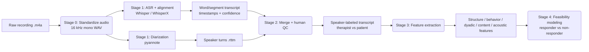

# PSYCH-ASR: Psychotherapy Session ASR, Diarization & Outcome-Linked NLP

Feasibility pipeline for **automated transcription and NLP-based characterization of
early psychotherapy sessions**, with the goal of predicting treatment response and
estimating therapist fidelity from what is actually said in the room.

Unlike most prior NLP-for-clinical-outcome work — which operates on text-based
interventions — this project works from **spoken psychotherapy session recordings**.
The near-term deliverable is feasibility data and reusable data-processing pathways to
support a grant application (R21, possibly R01) for processing the full set of sessions.

> **On-prem only.** Recordings are identifiable PHI. Every model in this pipeline
> (ASR, diarization, downstream NLP) runs locally on LIBR compute. No audio, transcript,
> or derived feature ever leaves the node or is sent to an external API. See
> [Privacy & Data Handling](#privacy--data-handling).
> **Companion documentation — read this first.** This README documents the *pipeline
> architecture*. The plain-language research narrative and this project's live task list
> live in the separate **`Research-Journey`** repo, in the home folder as a sibling of this
> repo (`~/Research-Journey`). It is its own private git repo (on GitHub as
> `Pirate-Hunter-Zoro/Research-Journey`) and is a **multi-project narrative hub** covering
> both this project and the sibling `TRD-EHR` project. Start there for "where are we / what's
> the story"; this project's live task list is `~/Research-Journey/planning/PSYCH-ASR_TODO.txt`.
>
> **Division of labour between the two files.** The TODO tracks **only what is left**.
> Finished work is never annotated there as "DONE" — its entry is deleted, and whatever
> is durably worth knowing (what exists, where it lives, how it was staged, which traps
> were paid for) graduates **into this README**. Git history records completion; the TODO
> records intent. Anyone editing either file, human or agent, follows this.

---

## Goals

1. Evaluate feasibility and accuracy of **ASR + speaker diarization** on LIBR
   psychotherapy recordings.
2. Extract early-session (sessions 1–3) language, interaction, and acoustic features.
3. Test whether those features predict treatment response **beyond** baseline severity
   and early symptom change.
4. Train preliminary models to estimate session- and item-level **therapist fidelity**
   from transcripts.

The feasibility framing matters: the goal is not a perfect transcript, but the ability to
**quantify transcript quality** and identify which feature types remain reliable enough to
use despite ASR/diarization error.

## Pilot design

- Parent trial: ~70/group randomized; ~65–68/group attended ≥1 session.
- Pilot subset: **N≈20** from one intervention (behavioral activation) — 10 good
  responders, 10 poor responders.
- Scope: transcribe/analyze **sessions 1–3** only. Powered for feasibility and pattern
  detection, not for confirmatory prediction.

---

## Pipeline


```mermaid
graph LR
    A[Raw recording .m4a] --> B(Stage 0: Standardize audio<br/>16 kHz mono WAV)
    B --> C[Stage 1: ASR + alignment<br/>Whisper / WhisperX]
    B --> D[Stage 1: Diarization<br/>pyannote]
    C --> E[Word/segment transcript<br/>timestamps + confidence]
    D --> F[Speaker turns .rttm]
    E --> G(Stage 2: Merge + human QC)
    F --> G
    G --> H[Speaker-labeled transcript<br/>therapist vs patient]
    H --> I(Stage 3: Feature extraction)
    I --> J[Structure / behavior / dyadic / content / acoustic features]
    J --> K(Stage 4: Feasibility modeling<br/>responder vs non-responder)
```

**Stage 0 — Standardize.** Convert each recording to 16 kHz mono WAV with a consistent
naming convention. (The pilot session recordings are ~50 min, 32 kHz, mono AAC — a
single mixed channel, so diarization cannot rely on channel separation.)

**Stage 1 — ASR + Diarization.** `whisper`/`whisperx` for the transcript with word-level
timestamps and confidence; `pyannote` for speaker turns. WhisperX is the intended glue: it
runs Whisper, forced-aligns to word-level timestamps, and assigns speakers from pyannote in
one pass.

**Stage 2 — Human-in-the-loop QC.** Map anonymous `SPEAKER_00/01` labels to
therapist/patient, flag and correct mid-session speaker swaps, and hand-correct a
*stratified subset* to estimate word error rate (WER) and diarization error rate (DER).

**Stage 3 — Feature extraction.** Conversation structure (talk-time ratio, turns, turn
length, speech rate, silence, overlap), therapist behaviors (question types, reflections,
validation, agenda-setting), patient behaviors (affect, approach/avoidance, hopelessness,
self-efficacy), dyadic process (e.g. reflection → patient emotion), content themes, and
acoustic/paralinguistic features (pause duration, pitch variability).

**Stage 4 — Feasibility modeling.** Do features separate responders from non-responders
beyond baseline severity and early symptom change?

---

## Environment & compute

On-prem Linux compute node with GPUs, Slurm-scheduled. Conventions mirror the TRD-EHR
project on this box:

- **Partition:** `c3_accel`, request GPUs via `#SBATCH --gres=gpu:N`.
- **Modules:** `module load Anaconda3/2025.06-0`.
- **Env:** one conda *prefix* env, `asr_env` (Python 3.11), under
  `/media/studies/ehr_study/analysis/mferguson/venvs/`, built by
  `scripts/setup_envs.sh` (not committed here).
- **GPU pinning:** jobs select the freest GPU via `nvidia-smi --query-gpu=memory.free`
  and set `CUDA_VISIBLE_DEVICES` to dodge bare-metal squatters Slurm can't see.
- **Model weights (offline):** the login node has outbound internet; the compute
  nodes do not. All model weights are downloaded once into a `models/` directory on
  study storage and loaded from there by absolute path, with `HF_HUB_OFFLINE=1` set
  in every job so a stray Hub request fails fast instead of hanging on a compute
  node.

Core libraries (pinned in `scripts/setup_envs.sh`): **`whisperx` 3.8.6 anchors the
whole stack** — its `~=` dependency pins force `torch`/`torchaudio` 2.8.x,
`torchvision` 0.23.x, `ctranslate2` 4.8.1, `faster-whisper` 1.2.1, and
`pyannote.audio` 4.0.7, alongside `transformers` 4.55.4, `soundfile`, and the
system `ffmpeg` 5.1.9 used for Stage 0. The node's CUDA-13.3 driver runs the cu12
`torch` wheels (backward-compatible); ctranslate2's cuDNN 9 rides in with torch, so
no system cuDNN is required. pyannote models are gated on Hugging Face — accept the
terms and download weights once with a token, after which everything runs offline.

### Staging model weights (offline)

Because compute nodes have no internet, every model is downloaded **once on the login
node** into a `models/` directory on study storage and thereafter loaded by absolute
path with `HF_HUB_OFFLINE=1`. The Hugging Face CLI (`hf`) ships inside the `asr_env`
conda environment.

**Diarization model — `pyannote/speaker-diarization-community-1`.** WhisperX 3.8.6
defaults its diarizer to this model, and pyannote.audio 4.0.7's `SpeakerDiarization`
pipeline is built around it: segmentation, embedding, and PLDA all live as subfolders
of that single repo, and clustering defaults to `VBxClustering`. Because it is
self-contained, staging it needs no config edits and no `--diarize_model` override.

> The older `pyannote/speaker-diarization-3.1` does **not** work offline on
> pyannote.audio 4.0.7: the 4.x pipeline constructor loads a PLDA model
> unconditionally, and the 3.1 config predates PLDA, so an offline load raises
> `LocalEntryNotFoundError`. Use community-1.

One-time setup:

1. **Authenticate.** Create a read-scoped token at
   `huggingface.co/settings/tokens` and place it in a git-ignored `.env` at the repo
   root as `HF_TOKEN=...`. Never commit the token.
2. **Accept the gate.** While logged in as the token's account, open the model page
   and click *"Agree and access repository."* community-1 is auto-gated, so access is
   granted instantly (no manual approval).
3. **Download into `models/`.** With `asr_env` active, from the repo root:

   ```bash
   set -a; source .env; set +a        # export HF_TOKEN for this shell
   hf download pyannote/speaker-diarization-community-1 \
     --local-dir /media/studies/ehr_study/analysis/mferguson/models/pyannote-speaker-diarization-community-1
   ```

   Do **not** set `HF_HUB_OFFLINE` for the download — only for the later load.
4. **Load offline.** In pipeline code, set `HF_HUB_OFFLINE=1` and call
   `Pipeline.from_pretrained()` with the **absolute local directory**, never the Hub id.

**ASR model — `Systran/faster-whisper-large-v3`.** Staged into
`models/faster-whisper-large-v3` and loaded by absolute path. `scripts/stage_models.sh`
automates the login-node staging: it activates `asr_env`, sources the git-ignored `.env`
with auto-export on (so the `hf` CLI actually inherits `HF_TOKEN` — without auto-export
the token stays shell-local and the download 401s), clears `HF_HUB_OFFLINE` for the
download only, then runs `hf download --local-dir`. A successful stage leaves seven files
with `model.bin` at ~3.6 GB; the `.lock` residue under `.cache/huggingface/download/` is
normal and can be ignored — the half-failed case is locks with *no* real weights beside
them.

The same download recipe stages any other Hugging Face model: one
`hf download ... --local-dir models/<name>` on the login node, then load by path.

> **Verify a staged model, don't assume it.** `hf download` can terminate leaving a
> directory that contains only `README.md` and empty weight subfolders, with lock files
> under `.cache/huggingface/download/` as the only trace. The directory looks staged from
> a casual `ls`. Always confirm by file count *and* an actual offline load before treating
> a model as available.

**Forced alignment is not a Hugging Face download.** For English, WhisperX resolves its
alignment model to a **torchaudio** bundle (`WAV2VEC2_ASR_BASE_960H`), fetched from
`download.pytorch.org` into the Torch hub cache — not from the Hugging Face Hub. Setting
`HF_HUB_OFFLINE=1` therefore does *not* protect this path, and on a node without outbound
internet it will stall exactly the way an unstaged Hub model does. That cache is warmed on
the login node by `scripts/stage_models.sh`, which exports `TORCH_HOME` to
`models/torch_home` on study storage and runs `scripts/warm_align_cache.py`; torch writes
the 360 MB `wav2vec2_fairseq_base_ls960_asr_ls960.pth` into a `hub/checkpoints` subfolder
of it, and a re-run reuses it silently. **Every job must export the same `TORCH_HOME`** —
exporting the variable, not merely having the files on disk, is what makes torch reuse the
cache instead of re-fetching into `~/.cache`.

**Sentence splitting is a third offline dependency.** WhisperX's alignment step imports
`nltk` and loads `tokenizers/punkt_tab/english.pickle`, falling back to a live
`nltk.download()` if the lookup fails — an outbound call that neither `HF_HUB_OFFLINE` nor
`TORCH_HOME` covers. `scripts/stage_models.sh` downloads the `punkt_tab` package into
`models/nltk_data` and exports `NLTK_DATA` to it. Note that **`english.pickle` does not
exist as a file**: `punkt_tab` ships per-language folders of `.tab`/`.txt` data and NLTK
synthesizes a `PunktTokenizer` from them when that name is requested. The absence of a
`.pickle` on disk is not a failed download.

**Three environment variables must be exported in every job**, not merely pointed at:
`HF_HUB_OFFLINE=1`, `TORCH_HOME`, and `NLTK_DATA`. Each library reads its own variable to
find its cache; having the files on study storage is necessary but not sufficient.

---

## Repository layout

```bash
.
├── README.md              # this file (committed)
├── .gitignore             # PHI, audio, transcripts, envs all excluded
├── scripts/               # pipeline code (Stage 0–4)
│   ├── setup_envs.sh          # builds the asr_env conda prefix env
│   ├── standardize.sh         # Stage 0: one .m4a path in -> 16 kHz mono WAV in data/
│   ├── stage_models.sh        # login-node staging of all offline model assets
│   ├── warm_align_cache.py    # fetches the torchaudio alignment bundle into TORCH_HOME
│   └── gpu_smoke.py           # GPU/ctranslate2 sanity check
├── slurm_jobs/            # .sbatch job scripts; logs/ gitignored
│   └── gpu_smoke.sbatch       # proven GPU-job scaffold — clone it for new GPU jobs
└── data/                  # raw + derived data — GITIGNORED (PHI)
```

The plain-language narrative and this project's task list now live in the
sibling `~/Research-Journey` repo (see the **Companion documentation** note at the
top of this README); the former `writeup/` directory was relocated there.

---

## Privacy & Data Handling

- Recordings are **identifiable PHI**; participant IDs appear in filenames.
- `.gitignore` excludes all audio, converted audio, transcripts, diarization output
  (`.rttm/.srt/.vtt`), and structured feature files (`.json/.csv/.parquet`) by default.
- All processing is **on-prem**; no external/cloud inference.
- Raw and derived data live under `data/` (gitignored) or on study storage — never in the
  tracked tree.
